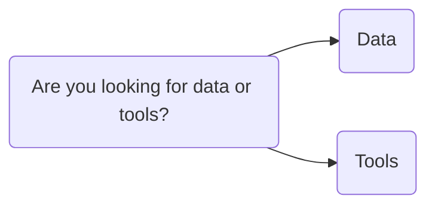

This work is based off Wei Kheng Teh's [knowledge graph](https://drive.google.com/file/d/18noPZdzeq7EEZjzb1G2sigk4KnGmBbPc/view)

It's still Work In Progress, so please if you have any suggestions or would like to add a resource to the graph please
feel free to open a pull request.