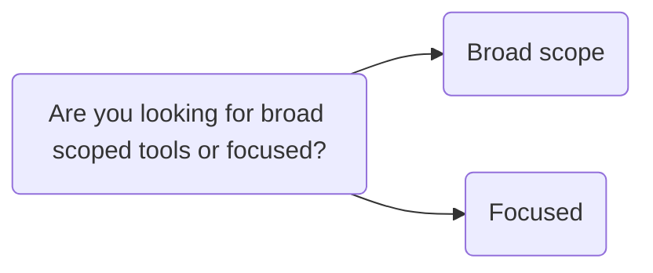

```mermaid
  graph LR; 
  A(Are you looking for broad scoped tools or focused?)-->B(Broad scope); 
  A-->C(Focused)
  click B "2_broad_scope.html"
  click C "2_focused.html"
```

[Go Back](../index.html){: .btn .btn-purple }

[Start again](../index.html){: .btn .btn-red }