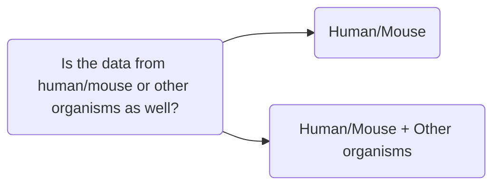

```mermaid
  graph LR; 
  A(Is the data from human/mouse or other organisms as well?)-->B(Human/Mouse); 
  A-->C(Human/Mouse + Other organisms)
  click B "3_human_mouse.html"
  click C "3_other_organisms.html"
```

[Go Back](1_data.html){: .btn .btn-purple }

[Start again](../index.html){: .btn .btn-red }