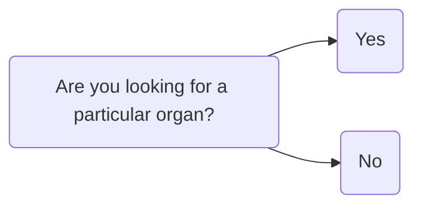

```mermaid
  graph LR; 
  A(Are you looking for a particular organ?)-->B(Yes); 
  A-->C(No)
  click B "4_organ_specific_atlas.html"
  click C "4_non_organ_specific_atlas.html"
```

[Go Back](2_gene_expression_data.html){: .btn .btn-purple }

[Start again](../index.html){: .btn .btn-red }