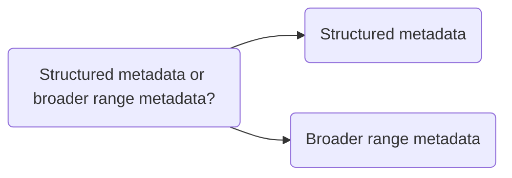

```mermaid
graph LR;
A(Structured metadata or broader range metadata?)-->B(Structured metadata);
A-->C(Broader range metadata)
click B "4_structured_metadata.html"
click C "4_broader_range_metadata.html"
```

[Go Back](2_primary_data.html){: .btn .btn-purple }

[Start again](../index.html){: .btn .btn-red }