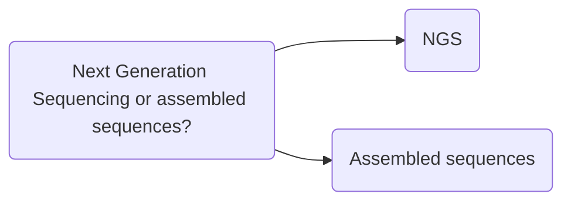

```mermaid
graph LR;
A(Next Generation Sequencing or assembled sequences?)-->B(NGS)
A-->C(Assembled sequences)
click B "5_ngs.html"
click C "5_assembled_sequences.html"
```

[Go Back](3_open_data.html){: .btn .btn-purple }

[Start again](../index.html){: .btn .btn-red }