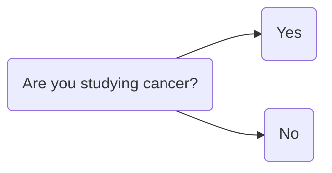

```mermaid
  graph LR; 
  A(Are you studying cancer?)-->B(Yes); 
  A-->C(No)
  click B "5_cancer.html"
  click C "5_non_cancer.html"
```

[Go Back](3_human_mouse.html){: .btn .btn-purple }

[Start again](../index.html){: .btn .btn-red }