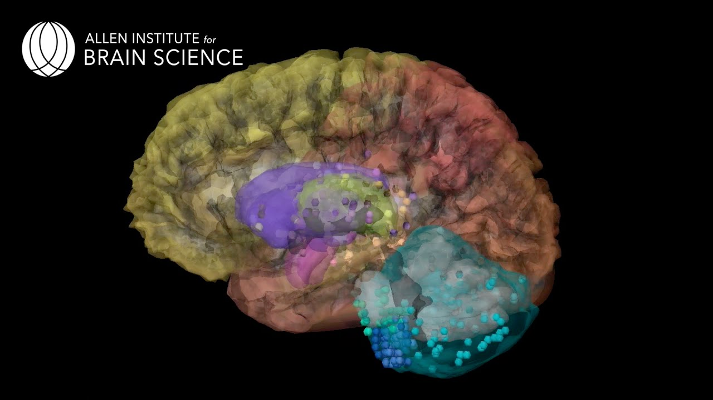

# Portals with Gene expression data associated to a specific organ

||||  |
|||-----------------------------|---------------------------|
|**Characteristics**| Kidney Precision Medical Atlas, with structured metadata and many techniques| Visualization, raw data available, imaging data available | Multiple atlases with a huge collection of data related to brain |
|**URL** | https://atlas.kpmp.org/ | https://www.lungmap.net/ | https://portal.brain-map.org/|

[Go Back](3_human_mouse.html){: .btn .btn-purple }

[Start again](../index.html){: .btn .btn-red }