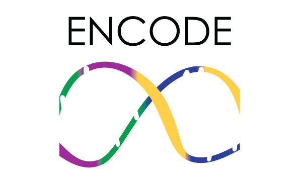

# Open data, structured metadata

When wanting to access single-cell transcriptomics/genomics open data with structured metadata, there are mainly 3 options for consideration.

||||  |
|||-----------------------------|---------------------------|
|**Characteristics**| ENCODE-focused funding | NCBI-Based database | EBI-Based database |
|**URL** | https://www.encodeproject.org/  | https://www.ncbi.nlm.nih.gov/geo/ | https://www.ebi.ac.uk/biostudies/|

[Go Back](3_open_data.html){: .btn .btn-purple }

[Start again](../index.html){: .btn .btn-red }