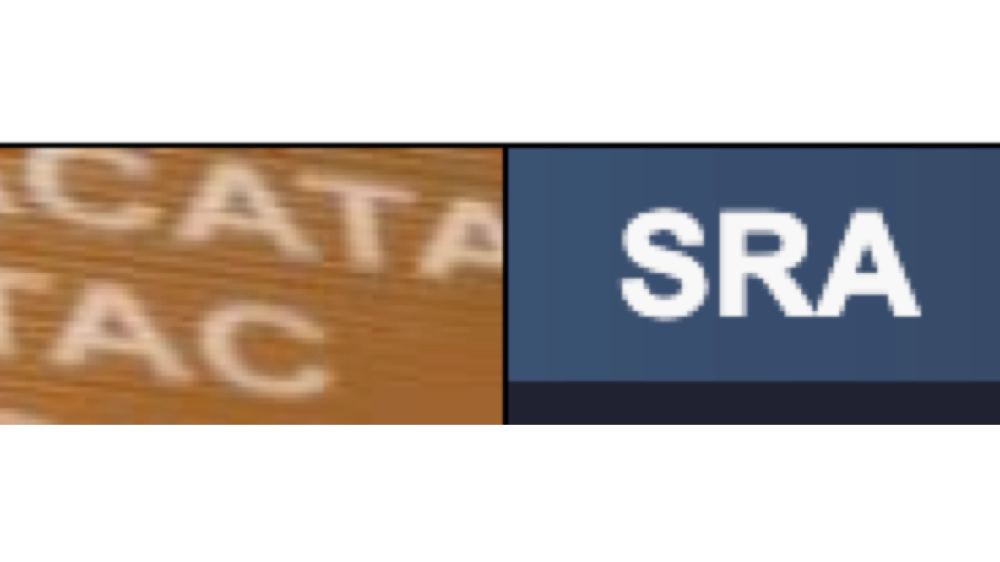

# Next Generation Sequencing data

|||  |
||-----------------------------|---------------------------|
|**Characteristics**| NCBI-Based database | EBI-Based database | 
|**URL** | https://www.ncbi.nlm.nih.gov/sra  | https://www.ebi.ac.uk/ena/browser/home | 

**Note**: Please note that both are part of [INSDC](https://www.insdc.org/), so they are effective mirrors of each other.
Please use one or the other at your convenience, as they will contain the same data.

[Go Back](4_broader_range_metadata.html){: .btn .btn-purple }

[Start again](../index.html){: .btn .btn-red }