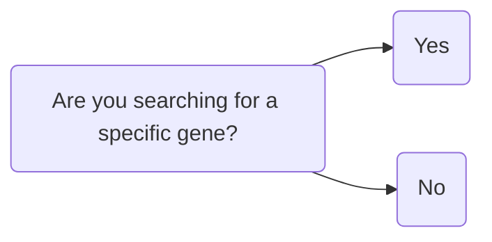

```mermaid
  graph LR; 
  A(Are you searching for a specific gene?)-->B(Yes); 
  A-->C(No)
  click B "5_specific_gene.html"
  click C "5_non_specific_gene.html"
```

[Go Back](4_non_organ_specific_atlas.html){: .btn .btn-purple }

[Start again](../index.html){: .btn .btn-red }