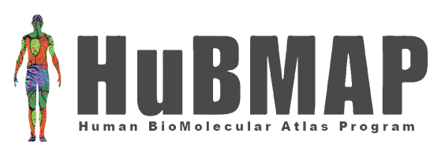
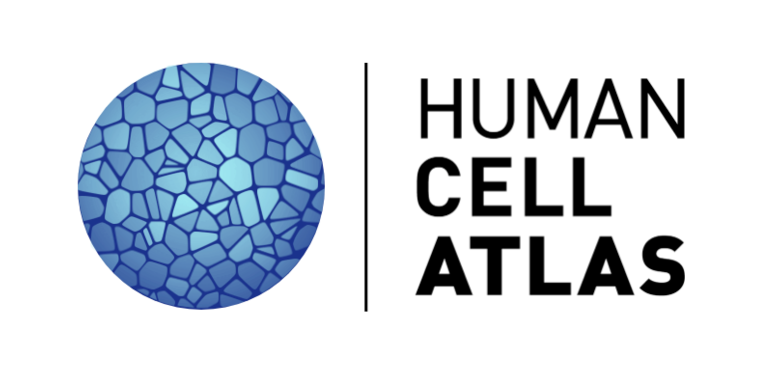

# Non gene-specific data portals

||||  |
|||-----------------------------|---------------------------|
|**Characteristics**| **Open data**, large scale consortia with donor, sample metadata, tools, and gene expression | **Open data**, comprehensive single cell sequencing portal with standardized metadata | **Non-open**, nucleomics, sequencing and microscopy data |
|**URL** | https://hubmapconsortium.org/  | https://data.humancellatlas.org/ | https://www.4dnucleome.org/ |

[Go Back](4_non_cancer.html){: .btn .btn-purple }

[Start again](../index.html){: .btn .btn-red }