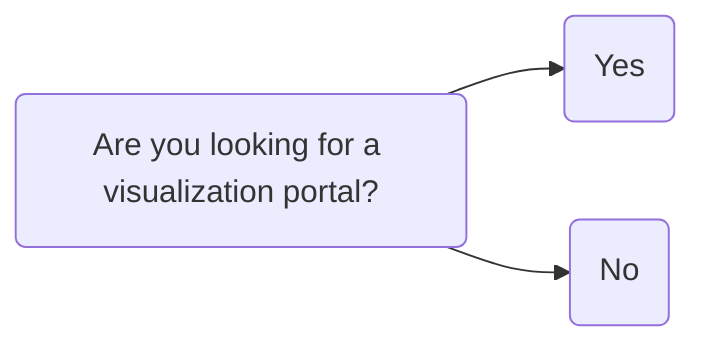

```mermaid
  graph LR; 
  A(Are you looking for a visualization portal?)-->B(Yes); 
  A-->C(No)
  click B "6_visualization_portal.html"
  click C "6_no_visualization_portal.html"
```

[Go Back](4_non_cancer.html){: .btn .btn-purple }

[Start again](../index.html){: .btn .btn-red }